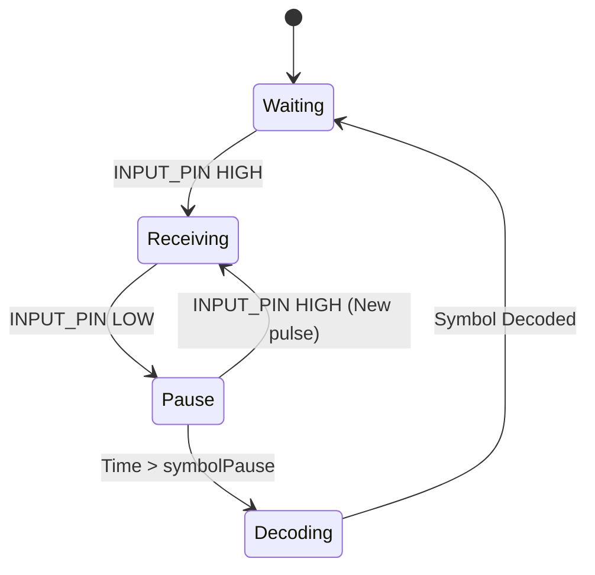

## Двусторонняя система связи на базе кода Морзе

Данная разработка представляет собой реализацию коммуникационной системы между двумя микроконтроллерами Arduino, использующую кодирование по азбуке Морзе. Поддерживается автоматическая отправка текста через Serial-интерфейс и ручной ввод сигналов через кнопку. Результаты декодирования выводятся на LCD экран.

## Ресурсы

* [**Модель в Tinkercad**](https://www.tinkercad.com/things/biTb7GczJ4b-morsecode)
* [**Видео-демонстрация работы**](https://disk.yandex.ru/d/Akw_K23gmVyccg)


## Архитектура системы

Проект включает два независимых узла (Node 1 и Node 2). Каждый узел обеспечивает:
1.  **Прием сигналов:** Анализ последовательности импульсов (точки и тире) с последующей конвертацией в текстовые символы.
2.  **Передачу сигналов:**
    *   *Автоматический режим:* Конвертация текста из Serial Monitor в последовательность сигналов Морзе.
    *   *Ручной режим:* Прямая передача состояния кнопки на выходной пин (Raw Mode).

Информация отображается на LCD дисплее (I2C интерфейс) и дублируется в Serial Monitor для контроля работы.

## Подключение оборудования (для одного МК)

| Компонент  | Пин Arduino      | Назначение                          |
|:-----------|:-----------------|:------------------------------------|
| **INPUT_PIN** | 7                | Входной сигнал (прием)              |
| **OUTPUT_PIN** | 8                | Выходной сигнал (передача)          |
| **BUTTON_PIN** | 4                | Кнопка для ручного ввода            |
| **STATUS_LED**    | 9                | Индикатор активности приема/передачи |
| **LCD**    | I2C <br/>A4 и A5 | Отображение принятых сообщений      |

**Схема соединения устройств:**
*   `OUTPUT_PIN` первого МК соединяется с `INPUT_PIN` второго МК.
*   `INPUT_PIN` первого МК соединяется с `OUTPUT_PIN` второго МК.
*   Общая земля (GND) у всех устройств.


## Алгоритм работы и протокол передачи

### Временные характеристики (Timing)
Базовая единица времени установлена как `baseUnit = 300 ms`.
*   **Точка (.):** `< 450 ms` (1.5 * baseUnit)
*   **Тире (-):** `>= 450 ms`
*   **Интервал между символами:** `900 ms` (3 * baseUnit)
*   **Интервал между словами:** `2100 ms` (7 * baseUnit)

### Режимы работы (Автоматический и Ручной)

В системе применяются два способа формирования сигнала, которые прозрачны для приемной части:

1.  **Автоматический режим:**
    *   Пользователь вводит символ в Serial Monitor.
    *   Микроконтроллер находит соответствующий код в таблице Морзе.
    *   Функция `transmitMorseCode()` формирует импульсы с заданными интервалами на выводе `OUTPUT_PIN`.
    *   В периоды пауз применяется `nonBlockingDelay()`, которая обеспечивает возможность параллельного приема входящих сообщений.

2.  **Ручной режим:**
    *   Пользователь управляет физической кнопкой.
    *   Состояние кнопки напрямую передается на `OUTPUT_PIN` (`digitalWrite(OUTPUT_PIN, HIGH/LOW)`).
    *   Программная коррекция длительности отсутствует — длительность точки или тире определяется только временем удержания кнопки.
    *   Микроконтроллер отслеживает длительность своих нажатий для логирования отправленных символов в Serial.

### Механизм приема (Состояния приемника)

Приемная часть функционирует в главном цикле `loop()` без блокирующих операций.

**Диаграмма состояний:**



1.  **Waiting (Ожидание):** Постоянный мониторинг `INPUT_PIN`.
2.  **Receiving (Прием импульса):** Фиксация момента начала импульса (`millis()`).
3.  **Signal Processing:** При переходе в LOW вычисляется длительность.
    *   Если `duration < dotMaxTime` → добавляется `.`
    *   Если `duration >= dotMaxTime` → добавляется `-`
4.  **Decoding (Декодирование):** Если `INPUT_PIN` находится в LOW дольше `symbolPause`, накопленный буфер (например, `...---...`) преобразуется в символ ASCII.


## Программная реализация

### Неблокирующий подход
Основная особенность реализации — применение функции `nonBlockingDelay()` вместо стандартного `delay()`. Это позволяет микроконтроллеру продолжать обработку входящих сигналов даже во время пауз между передачей своих сообщений.

```cpp
void nonBlockingDelay(unsigned long waitMs) {
  unsigned long startTime = millis();
  while (millis() - startTime < waitMs) {
    processIncomingSignal(); // Продолжаем обработку входящих
  }
}
```

### Организация передачи
Хотя физически передача представляет собой непрерывный поток импульсов, логически она разделяется на символы благодаря паузам между ними.
*   **Границы символов:** Определяются временными интервалами (`symbolPause`).
*   **Данные:** Последовательность точек и тире согласно таблице кодировки Морзе.


## Инструкция по настройке и использованию

1.  Открыть проект в Arduino IDE или VS Code с PlatformIO.
2.  Установить библиотеку `LiquidCrystal_I2C`.
3.  Для первого МК установить `#define BOARD_ID 1`.
4.  Для второго МК установить `#define BOARD_ID 2`.
5.  Загрузить прошивку на соответствующие устройства.
6.  Для проверки автоматического режима: Открыть Serial Monitor (9600 baud), ввести текст (A-Z, 0-9).
7.  Для проверки ручного режима: Использовать тактовую кнопку на макете.